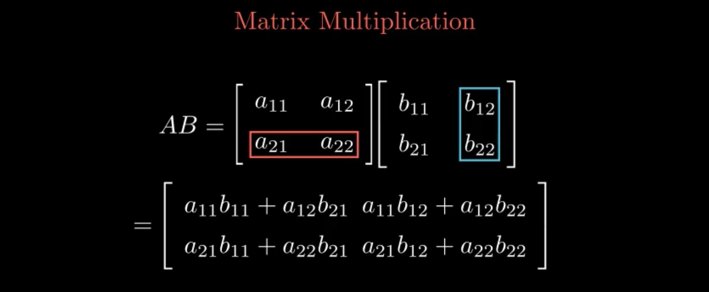

# A Simple Introduction To Groups
## Watch the full video at https://youtu.be/6CB7f29F40g

### How to Create the Animations
Steps:
1. Install the Python Manim Package by running `pip install manim` in your terminal.
2. Run `manim -pql grouptheorypg1.py GroupTheoryPageOne` in the parent directory of `grouptheorypg1.py` to create `GroupTheoryPageOne.mp4`.
3. Run `manim -pql grouptheorypagetwo.py GroupTheoryPageTwo` in the parent directory of `grouptheorypagetwo.py` to create `GroupTheoryPageTwo.mp4`.
4. Run `manim -pql grouptheorypagethree.py GroupTheoryPageThree` in the parent directory of `grouptheorypagethree.py` to create `GroupTheoryPageThree.mp4`.

### How to Create the Narrations
Steps:
1. Install the Python `pyttsx3` package by running `pip install pyttsx3` in your terminal.
2. Run `python3 grouptheorypg1audio.py` in the parent directory of `grouptheorypg1audio.py` to create `grouptheorypg1.mp3`.
3. Run `python3 grouptheorypg2audio.py` in the parent directory of `grouptheorypg2audio.py` to create `grouptheorypg2.mp3`.
4. Run `python3 grouptheorypg3audio.py` in the parent directory of `grouptheorypg3audio.py` to create `grouptheorypg3.mp3`.

### How to combine the mp3 and mp4 files

Suppose we want to combine `animation_video.mp4` and `narration.mp3` into a new mp4 file `output_video.mp4` that has both the animations and narration.

Steps:
1. Make sure `animation_video.mp4` and `narration.mp3` are in the same directory.
2. Run `ffmpeg -i animation_video.mp4 -i narration.mp3 -c:v copy -c:a aac output_video.mp4` in the parent directory of the mp4 and mp3 files.

### How to combine multiple mp4 files into a single mp4 file

Steps:
1. Write the name of each mp4 file in a new line of a file `mp4_file_list.txt`.
2. Run `ffmpeg -f concat -safe 0 -i mp4_file_list.txt -c copy full_video.mp4` in the parent directory of `mp4_file_list.txt`.
